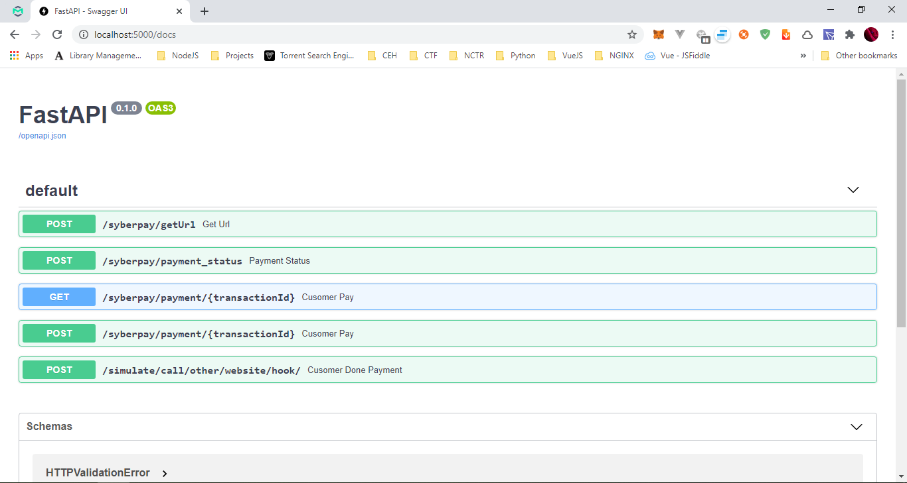
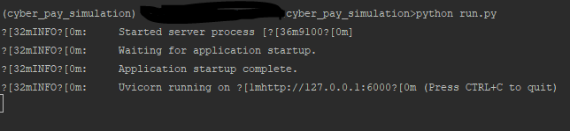

# PaySim

> Opensource for payment gateway simulation

**Description**:  There is a huge pain when linking with payment
systems in Sudan, when you want to link you have to go physically
and ask for their keys or whatever.

but with **PySim** you can have a simulated environment that can
help you setup the basic routes for your payment, and then go to
them for linking and you have a full fledged backend, that performs
well with which ever payment gateway of your choice.

This project is for student's as well who want to add payment logic
to their projects and have no chance to go through the complicated
protocols of going to the Provider and ask for keys. when all you 
want is just a payment gateway that gives you a response.

 

Other things to include:

  - **Technology stack**: This project is based on python 
  [FastApi](https://fastapi.tiangolo.com/).
  - **Status**:  V 1.0 this is the first release and the first commit 
  still under testing.

**Screenshot**: If the software has visual components, place a screenshot after the description; e.g.,




## Dependencies

- Python 3.x
- Pipenv, Virtualenv
- [Uvicorn](https://www.uvicorn.org/)

## Installation

To install and run the project you need to have a python 3.x, 
Pipenv installed or virtualenv installed to create a virtualenv

- if you have pipenv installed you can run to install the 
project related  requirement
```
pipenv install
```

- if you have virtualenv installed you can create a virtual env 
for python in the project and then run
```
pip install -r requirements.txt
```

## Configuration

Still cooking it, but for your record in the future it will 
be as simple as
- for [SyberPay](https://www.syberpay.com/) checkout [PaySim SyberPay How To.](./SyberPay.md)
```
python run.py syber

```

- for EBS
```
python run.py ebs

```

## Usage

for the current version it only support SyberPay so just
run the following
```
python run.py
```
this will run a uvicorn instance that will open for you the fastapi



you can view server docs by going to 
[http://localhost:5000/docs](http://localhost:5000/docs) will show you
the Api Documentation where you can start making requests and play with 
it


###### Server Environment Config

Create .env file and add the following
```
S_HOST = 127.0.0.1 # default 127.0.0.1
S_PORT = 5000 # default 5000 
S_LOG_LEVEL = info # default info [critical|error|warning|info|debug|trace]
```

## How to test the software

Testing instruction will be attached soon

## Known issues

Still under development.

## Getting help

Contact 
- Gmail: ibrahimalgadi.email@gmail.com
- [linked In](https://www.linkedin.com/in/ibrahim-algadi-270503192)

**Help And Support**

If you have questions, concerns, bug reports, 
etc, please file an issue in this repository's 
Issue Tracker.

## Getting involved

:) still crafting this section ;)

This section should detail why people should get involved and describe key areas you are
currently focusing on; e.g., trying to get feedback on features, fixing certain bugs, building
important pieces, etc.

General instructions on _how_ to contribute should be stated with a link to [CONTRIBUTING](CONTRIBUTING.md).


----

## Open source licensing info
1. [TERMS](TERMS.md)
2. [LICENSE](LICENSE)
3. [CFPB Source Code Policy](https://github.com/cfpb/source-code-policy/)


----

## Credits and references 
- I was working in a project and I wanted to link with Cyberpay
but still the project in the initial stage and i want to test
it and prepare for the lunch, so I need some guide.
- I remembered one of my friends was working in his graduation
project and he wanted to link it with an online payment, but his 
teacher told him it is hard and you can't do it, because there is 
no easy way to do it, unless going directly to the provider. So i
decided to help him as well.


## Sponsored by 
- **Power Of Space**