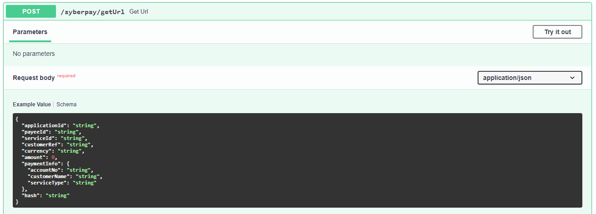
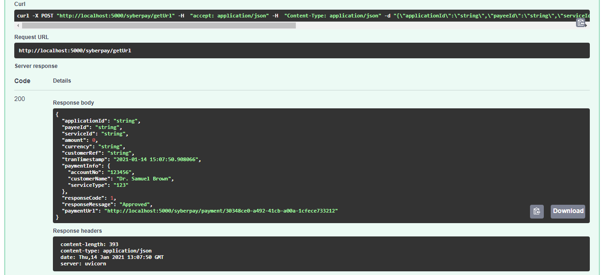
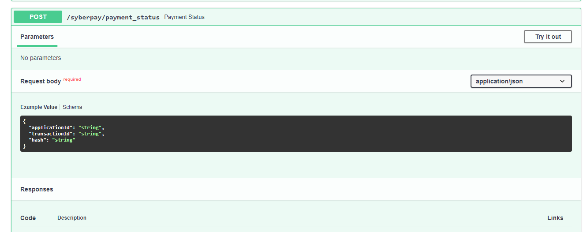
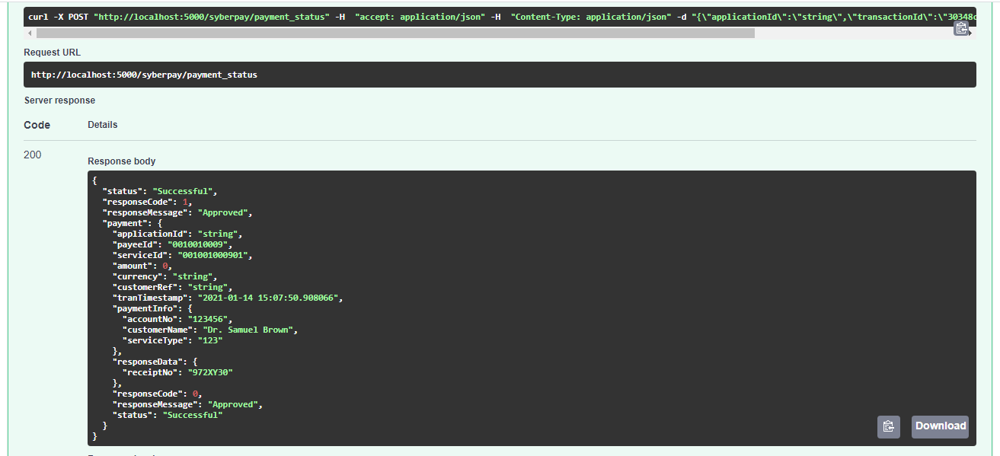

# PaySim For Syber Pay

**Description**:  So when you try to work with SyberPay there is a specific 
steps you have to go through, as specified by SyberPay Specifications Document
(Merchants) version 1.4

 
1 - The customer has been browsing the merchant’s website and has decided to
pay for a particular service using SyberPay as the payment method.

2 - Then you are going to call the end point to create for you a transaction id
by hitting /getUrl

and sending your payload with it
```
POST Request to /getUrl
{
    "applicationId":"0010010001",
    "payeeId":"0010010009",
    "serviceId":"001001000901",
    "customerRef":"628db23f",
    "currency":"SDG",
    "amount":100.0,
    "paymentInfo":
    {
        "accountNo":"123456",
        "customerName":"Mohammed Ahmed",
        "serviceType":"123"
    },
    "hash": "e1280edbe5bf00c237e6b724d63f0ddab2e48b1ee3b5db7573b59f293cae655a"
}
```
In the PaySim the request will be like


3 - Then there will be a response from SyberPay having a url that you will
take and send it to the customer so he can pay 

```

{
    "applicationId":"0010010001",
    "payeeId":"0010010009",
    "serviceId":"001001000901",
    "amount":100.0,
    "currency":"SDG",
    "customerRef":"628db23f",
    "tranTimestamp":"2015-08-13,10:04:58",
    "paymentInfo":
    {
        "accountNo":"123456",
        "customerName":"Mohammed Ahmed",
        "serviceType":"123",
    },
    "responseCode":1,
    "responseMessage":"Approved",
    "paymentUrl":"https://www.sybertechnology.com/syberpay/payment/1593135f-4110-4edc-bbd0-ebe134968498"
}

```
In the PaySim the response will be like


- then you send the (http://localhost:5000/syberpay/payment/30348ce0-a492-41cb-a00a-1cfece733212) to the 
customer 
- or in production you send the SyberPay one 
(https://www.sybertechnology.com/syberpay/payment/1593135f-4110-4edc-bbd0-ebe134968498)
this url is only valid for 10 minutes as specified by SyberPay docs
- in our simulation environment i haven't implemented expiry yet

4 - Then the customer will access the URL it will appear like this Ugly Page :)
then the customer will write his info and press Enter


5 - This will update the transaction state in the backend (In our case PySim) so
and it should call your Url Hook in your application to tell you a specific transaction
has been finished please call check_status url with the transaction id to
see the status **(Note: Still didn't implement this feature but i will just sooner)**

6 - Then you checkout the status by sending request to /payment_status

in our case it will look like this


from your lovely backend you send request to PaySim with the following post 
parameters

```

{
  "applicationId": "string",
  "transactionId": "string",
  "hash": "string"
}

```

in SyberPay you send 

```

{
    "applicationId":"0010010001",
    "transactionId":"1593135f-4110-4edc-bbd0-ebe134968498",
    “hash”: “e1280edbe5bf00c237e6b724d63f0ddab2e48b1ee3b5db7573b59f293cae655a”
}

```

in PaySim you send, notice the transaction id is the same as what is in the 
payment session Url (http://localhost:5000/syberpay/payment/30348ce0-a492-41cb-a00a-1cfece733212)

```

{
  "applicationId": "string",
  "transactionId": "30348ce0-a492-41cb-a00a-1cfece733212",
  "hash": "string"
}

```

7 - After sending this you will get response from PaySim weather the request 
went well or still pending
you take this response and give the customer access to whatever resources
he is paying for

the response from SyberPay will look like

```
{
    “status” : “Successful”,
    "responseCode":1,
    "responseMessage":"Approved",
    “payment” : {
        "applicationId":"0010010001",
        "payeeId":"0010010009",
        "serviceId":"001001000901",
        "amount":100.0,
        "currency":"SDG",
        "customerRef":"628db23f",
        "tranTimestamp":"2015-08-13,10:04:58",
        "paymentInfo": {
            "accountNo":"123456",
            "customerName":"Mohammed Ahmed",
            "serviceType":"123",
        },
        “responseData” : {
            “receiptNo” : “972XY30”
        },
        "responseCode": 0,
        "responseMessage": "Approved",
        "status": “Successful”
    }
}
```

the response from PaySim will look like

```
{
  "status": "Successful",
  "responseCode": 1,
  "responseMessage": "Approved",
  "payment": {
    "applicationId": "string",
    "payeeId": "0010010009",
    "serviceId": "001001000901",
    "amount": 0,
    "currency": "string",
    "customerRef": "string",
    "tranTimestamp": "2021-01-14 15:07:50.908066",
    "paymentInfo": {
      "accountNo": "123456",
      "customerName": "Dr. Samuel Brown",
      "serviceType": "123"
    },
    "responseData": {
      "receiptNo": "972XY30"
    },
    "responseCode": 0,
    "responseMessage": "Approved",
    "status": "Successful"
  }
}
```
